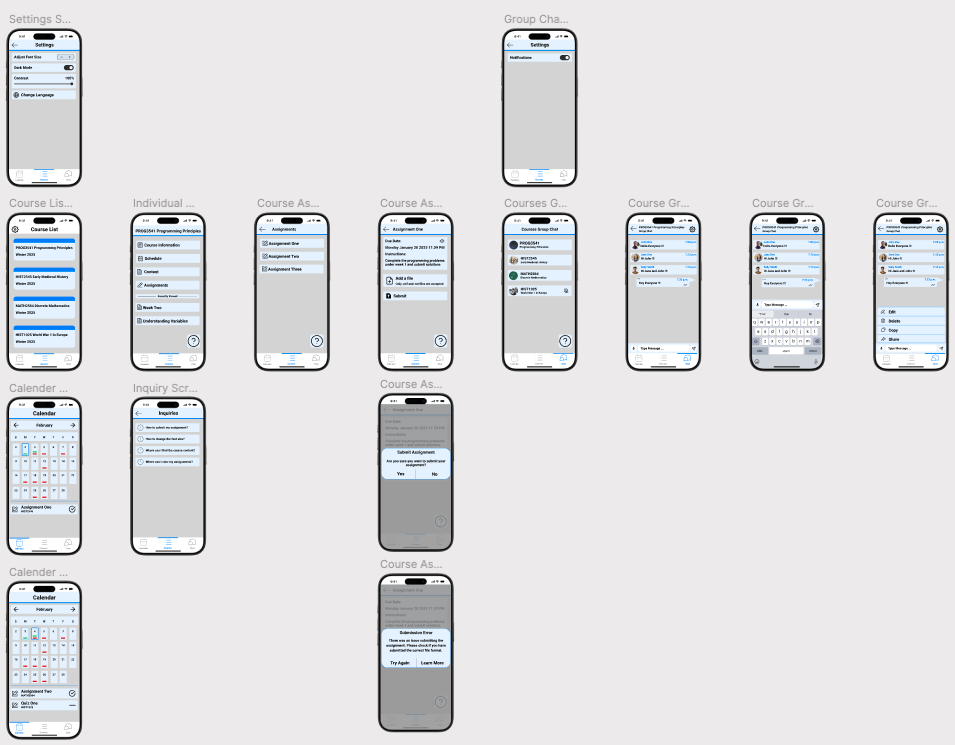
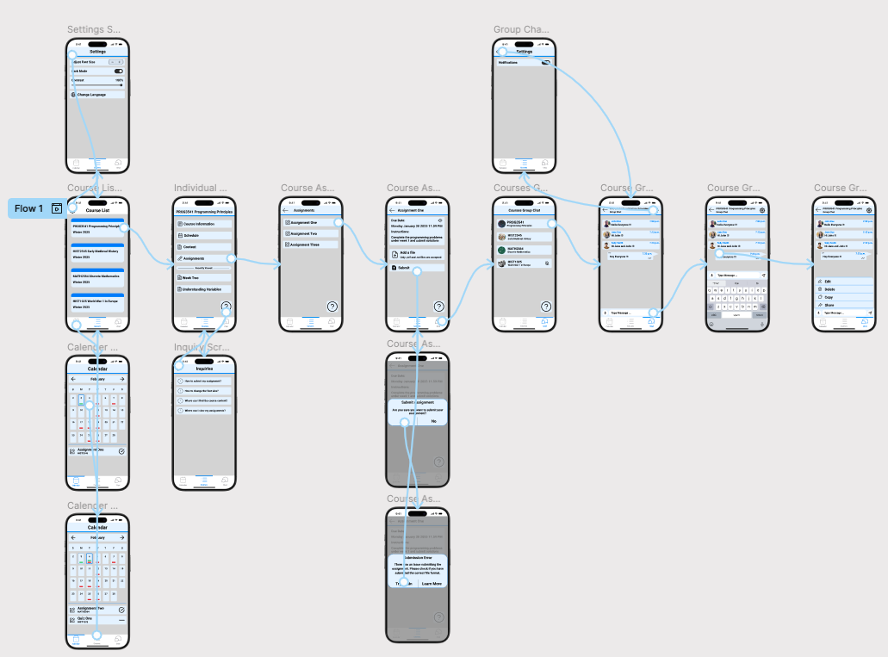

# Muhammad Choudhary HCI Assignment 2

## About

This git repo is for the prototype for HCI assignment 2. Most if not all student have a smart phone and use it more than computers. This app is designed for students to access all the course content from their smart phones.
I will also help students to stay productive because they can easily use their phone instead of computers to access the course content.

## Links

- [Link to Figma Design](https://www.figma.com/design/n3NwHRDDveASKrujJTzNQC/muhammad_choudhary_a2?t=ZMSvRxJQR359DqDh-1)
- [Link to Github Repository](https://github.com/freeHashBrown4/muhammad-choudhary-prototype)
- [Link to Youtube Demo](https://youtu.be/WEOrJ9kabA4)

## 🔥 Top Five New desirable Functionalities

The following are the top five new desirable functionalites that are not seen in any other app

- Their is an easy option to access help on each screen of app (Inquires Page)
- User is asked for confirmation before submitting an assignment (No accidental submissions of assignments)
- Calender feature that allows students to easily tell what assignments are due and completed
- Useful error messages that help students in finding a solution
- Users can use the text to voice feature to listen to assignment instructions

## Other Features

- Users can view all their enrolled courses
- Users can also adjust the app settings to their preferences
- Users with visual impairments can adjust colour contrast and font size
- Langauge of the app can also be changed to users preference
- Users can can check the calender to view which assignments are due
- Users can also check the content of a specific course
- Users can visit the inquiries page to seek answers for questions
- Recently viewed items will be displayed for quick access
- Users can submit assignments
- Each course has a dedicated group chat
- Users can send voice and text messages in the group chat

# Final Prototype

# Navigation of Final Prototype

